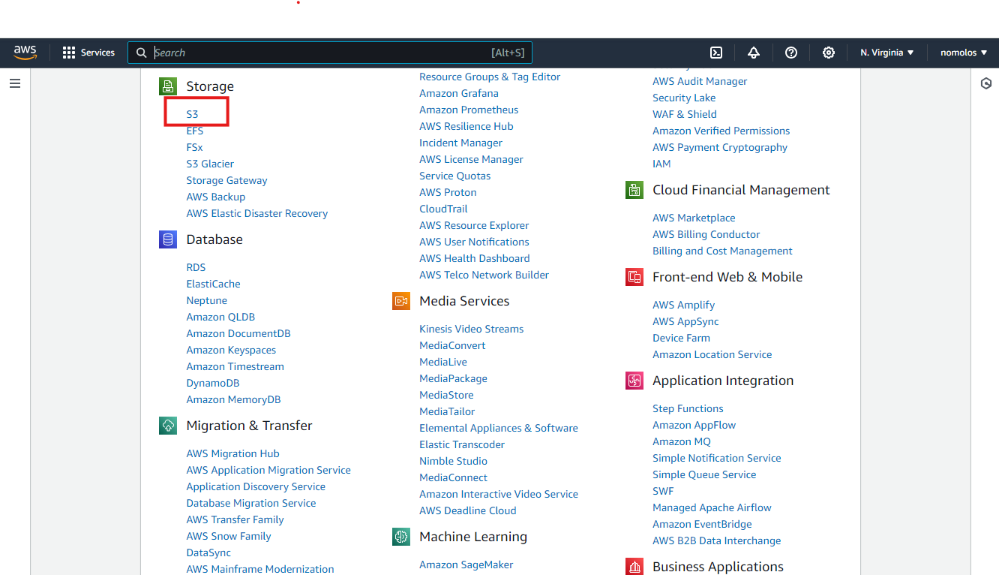

# S3 Mini Lab Projects

## Goal
The goal of this project is to familiatize participants with Amazon S3(Simple Storage Servoice) concepts, create and manage S3 buckets, upload objects, enable versioning, set persmissions for public access and implements lifecycle policies

### Step 1 - Login to AWS Console
Goto [AWS Console](https://console.aws.amazon.com/) and login with your credentials. Click on Services at the top left, then choose S3

### Step 1 - Choose the AMI
In the EC2 service menu, click on *Launch instance* and select *Launch Instance*.  

Select *Amazon Linux 2 AMI*. An AMI is a template that contains the software configuration (operating system, application server, and applications) required to launch your instance. In this first lab, we will stick to the x86 architecture.

