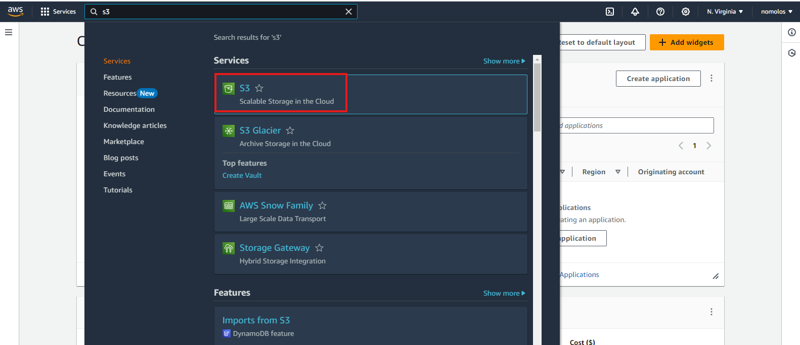

# S3 Mini Lab Projects

## Goal
The goal of this project is to familiatize participants with Amazon S3(Simple Storage Servoice) concepts, create and manage S3 buckets, upload objects, enable versioning, set persmissions for public access and implements lifecycle policies

## Step 1
### Login to AWS Console
Goto [AWS Console](https://console.aws.amazon.com/) and login with your credentials. Navigate to the search bar on the AWS console and search and select S3. Another page will appear, locate and click "Create bucket" button

### Create the bucket
The create bucket page will appear, provide a unique name for the bucket. Ensure the following
- ACLs Disabled is selected
- Block public access option is enabled
- Bucket versioning disabled
- click on create bucket, and bucket will be created successfully with no object inside it

### Upload an object into this bucket
We will create a sample text file to contain "Welcome to uploading file to bucket" and upload to the bucket
- click the Upload button a page will appear, add the file and click on upload
  
  
- The screenshot below shows the file was uploaded successfully
   

## Step 2
### Enabling versioning
By default the bucket versioning is disabled

- To enable versioning, click on the edit button, select enable option and save changes
 
- Now we modify the content of the file and upload it again. A new version is show below by enabling show versions
  
  
  
## Step 3
### Content view and permissions setting
In the permissions tab of the bucket, you would observe that block all public access is enabled

- Click on Edit button and uncheck the "Block all public access" option, Save changes and confirm
  
- 

This action we took ensure that file be accessible online. The next action involves creating bucket policy to specify action the public would have/perform on the file. 
- Click on the Edit button and click on policy generator
- Select the "Type of Policy" as "S3 Bucket Policy"
- Set the "Effect" to "Allow", specify the "Principal" as "*", which means all users.
- Choose the action "Get object" and "Get object version"
- In the field of Amazon Resource Name (ARN), type the ARN of your bucket and add by "/*" after the ARN. e.g arn:aws:s3:::first-s3-bucket-024/*
- Click on "Add statement" then click on generate policy
  

- Copy the policy, navigate to the bucket policy tab and paste
  

- Click on save changes
- We can view the different version of the file
  
Old version

New version

