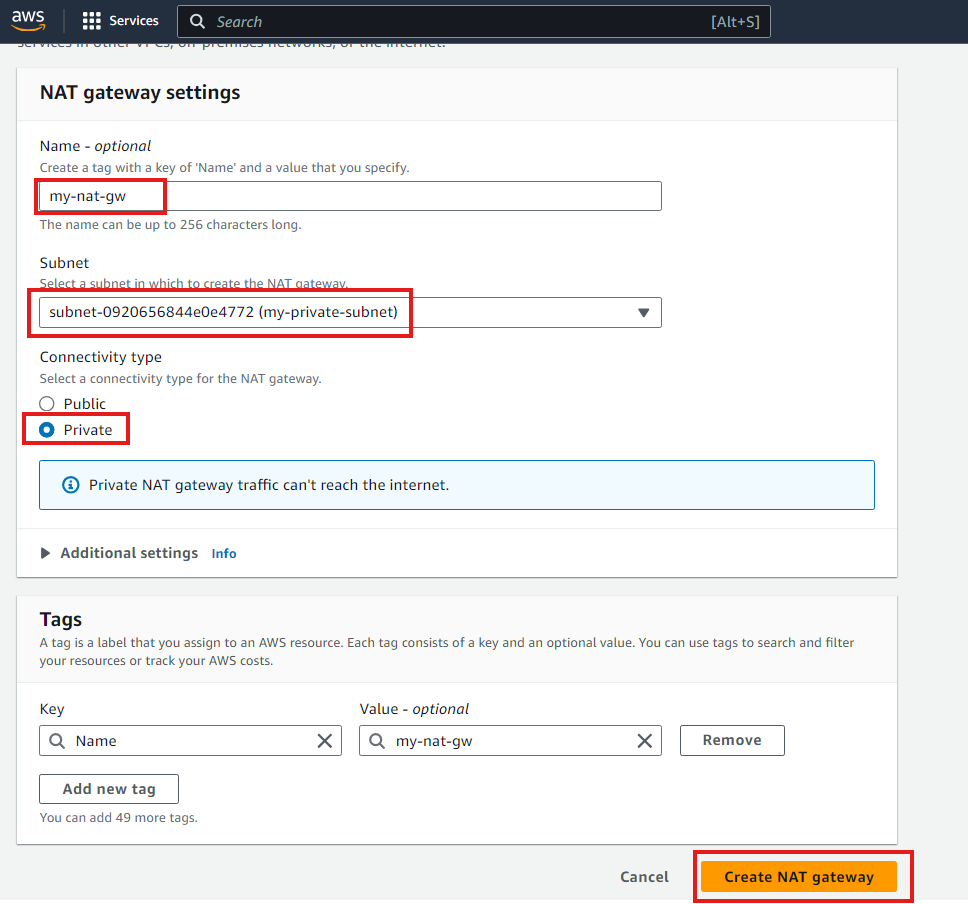
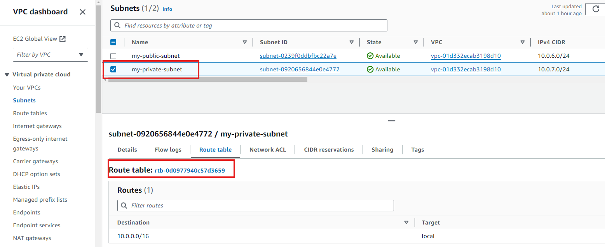

# VPC Mini Lab Projects

## Goal
The goal of this project is to have the understanding of Virtual Private Cloud(VPC), create and configure VPC, subnet, internet gateway, NAT gateway and VPC peering. Enable internet connectivity securely within a VPC, Implement outbound internet access through the NAT gateway, and establish direct communication between VPCs using VPC peering.

## Step 1
### Login to AWS Console
Goto [AWS Console](https://console.aws.amazon.com/) and login with your credentials. Navigate to the search bar on the AWS console and search and select VPC . 

### Create PVC
Another page will appear, click "Create VPC"
- Select VPC only option, specify CIDR block
- Click Create VPC button
  

The VPC created is as shown below

## Step 2
### Configuring subnet within the VPC
- Navigate to the Subnet link on the left sidebar and click
- The subnet page appears, click on create subnet
- 

- On the create subnet page (public subnet), select ID of the VPC we created earlier
- Enter the subnet name, choose available zone, and specify the IPv4 CIDR for the subnet
- Click Add new subnet button
  
  

We are creating a second subnet (private subnet), so repeat same steps and specify the following
- The subnet name, choose availability zone and provide IPv4 CIDR (e.g 10.0.7.0/24)
- Click create subnet button
  
  

We no whave the 2 completed subnets

## Step 3
### Creating Internet Gateways attached to VPC
- Navigate to Internet gateways on the left sidebar and click
- Next, click "Create Internet gateway" button
  

- Provide name for the internet gateway
- Click internet gateway button
- 

- The internet gateway is successfully created, and it is currently detached(meaning not attached to a vpc and so there can't be any internet connectivity)
- 
  

- Attach the internet gateway to the VPC

The internet gateway is now attached

Next we will be setting up Routing tables for internet coonectivity with the internet gateway.

-
## Step 4
### Creating Route table for connectivity
- Navigate to The Route table on the left sidebar and click
- Next, click "Create Route table" button
  

- Enter name of the route table and select the VPC
- Click on Create route table button
  

- Select Subnet association tab and click on Edit subnet associations

- Select the pulic subnet and click on save association

- Select the route table created, click the Routes tab and click edite routes

- Click the Add route, make the Destination as 0.0.0.0/0 (means every IPv4 address can access the subnet)
- On Target field select internet gateway and select the internet gateway we created earlier
- Saves changes

Now, the route table have been configured to route traffic to the internet gateway, allowing connectivity to the internet

## Step 5
### Creating NAT Gateway
We will enable Outbound Internet access through NAT Gateway, so we attach the NAT gateway to the subnet and route table
- Navigate to NAT gateways on the left sidebar and click 
- Next, click "Create NAT gateway" button and provide the following details

- Click on Create NAT gateway and is created successfully
  

- Select the NAT gateway and click on the subnet link or better still goto the subnet page and click on the Route table tab

- Click on the route table ID and select the route table 

- Move to Routes tab and click on Edit route

- Click on Add routes and make Destination as 0.0.0.0/0
- 

- For target field select NAT gateway and select the NAT gateway we created earlier
- Click on save

- On the Subnet association tab, click Edit subnet association

- Select private sunbet and clisk Save association
- 

The subnet have been successfully attached to the route table

 

### Footer Note:

**Internet Gateway:** Think of it like a door to the internet for your subnet. When you attach an Internet Gateway to a subnet, it allows the resources in that subnet like EC2 instances) to reach out to the internet and also allows internet traffic to reach those resources. It's like having a door both to enter and exit the subnet

**NAT Gateway:** Imagine it as a one-way street sign for your subnet's traffic. When you attach a NAT Gateway to a subnet, it lets the resources in that subnet (like EC2 instances) access the internet, but it doesn't allow incoming traffic from the internet to reach those resources, it's like the resources can go out to the internet, but the internet traffic can't directly come in

