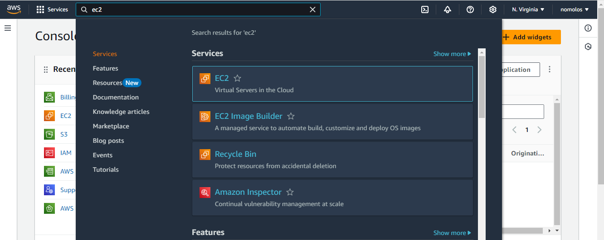
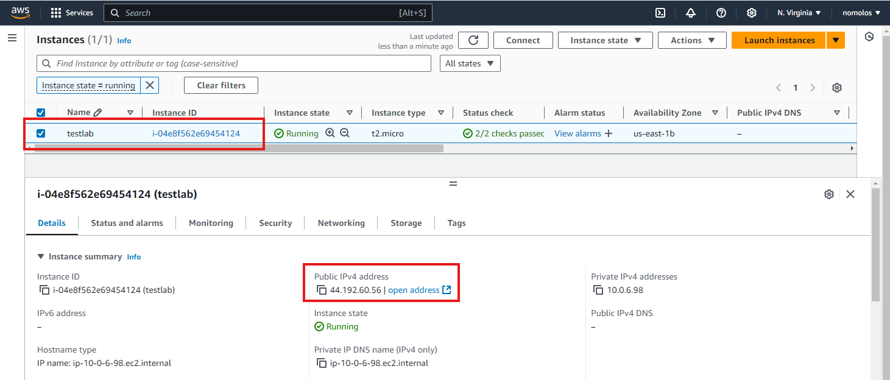
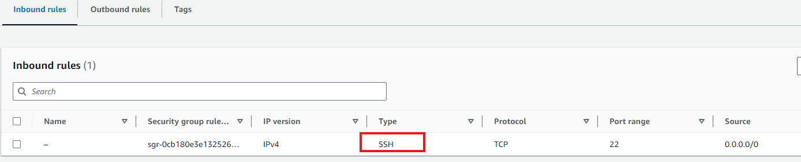
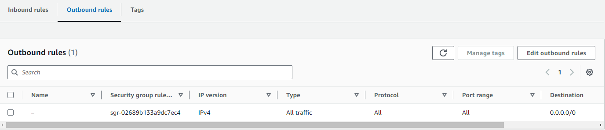
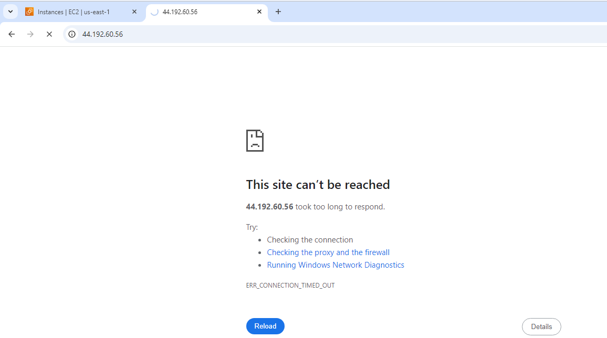

# Security Groups and NACLs  Mini Lab Projects

## Goal
To have understanding fundamental components of AWS infrastructure, including how Secunty Groups control inbound and outbound traffic to EC2 instances, and now Network Access Control List(NACL) act as subnet-level firewalls, regulating traffic entering and exiting subriets. 

## Step 1
### Login to AWS Console
Goto [AWS Console](https://console.aws.amazon.com/) and login with your credentials. Navigate to the search bar on the AWS console and search and select EC2. 

### Create an EC2 Instance
You can go through our previous session on how to create an EC2 instances that would host our website.

For the security group configuration of this instance, the inbound rules only IPv4 SSH traffic on port 22 is permitted to access this instance. For outbound rule, all IPv4 traffic with any protocol on any port is allowed, meaning this instance has unrestricted access to anywhere on the internet.

Next, we test connectivity to the website using the public IP address assign to this instance. so enter the public IP to your browser, it will load with this site can't be reached.
The reason for this is because we haven't defined HTTP protocol for the security group to allow outside access into the instance

**To resolve this issue follow this steps**
- Create a new security groups

